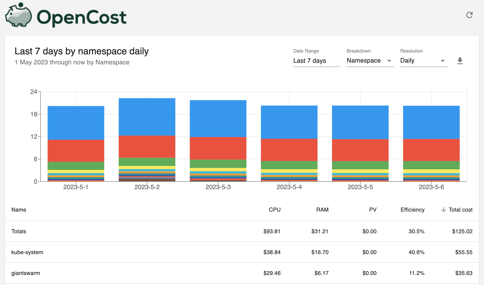

[](https://circleci.com/gh/giantswarm/opencost)

# Opencost chart

Currently in beta phase.

## How to install

Running opencost for MCs.
`helm install --set installation.name="gaia" --set cluster.name="gaia" opencost helm/opencost`

or

Running opencost for WCs.
`helm install --set installation.name="gaia" --set cluster.name="12abcd" opencost helm/opencost`

## How to connect

### Usage via CLI

Make sure you installed krew plugin for cost.

`kubectl krew install cost`

Run kubctl cost command, e.g.:
```
kubectl cost --service-port 9003 --service-name opencost --kubecost-namespace giantswarm --allocation-path /allocation/compute  \
    namespace \
    --historical \
    --window 7d \
    --show-cpu \
    --show-memory \
    --show-pv \
    --show-efficiency=true
```

```
+---------+-----------------------+------------+----------+-----------+-------------+----------+------------------+-----------------+
| CLUSTER | NAMESPACE             | CPU        | CPU EFF. | MEMORY    | MEMORY EFF. | PV       | TOTAL COST (ALL) | COST EFFICIENCY |
+---------+-----------------------+------------+----------+-----------+-------------+----------+------------------+-----------------+
| gaia    | kube-system           | 44.959830  | 0.237542 | 19.432300 | 0.790738    | 0.000000 |        64.392130 |        0.404486 |
|         | giantswarm            | 34.398330  | 0.052164 | 7.187850  | 0.400571    | 0.000000 |        41.586180 |        0.112384 |
|         | monitoring            | 13.451650  | 0.017671 | 1.972050  | 0.389696    | 0.000000 |        15.423700 |        0.065238 |
|         |   ...                 |   ...      |   ...    |   ...     |   ...       |   ...    |        ...       |        ...      |
+---------+-----------------------+------------+----------+-----------+-------------+----------+------------------+-----------------+
| SUMMED  |                       | 108.941470 |          | 36.226660 |             | 0.000000 |       145.168130 |                 |
+---------+-----------------------+------------+----------+-----------+-------------+----------+------------------+-----------------+
```

### Usage via UI

`kubectl -n giantswarm port-forward service/opencost 9090:9090`

Open your browser and go to `http://localhost:9090`




## How to uninstall

`helm uninstall opencost`

## Credit

- https://github.com/opencost/opencost
